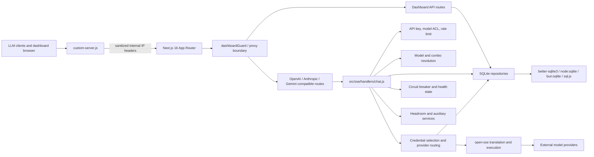

# ExtremeRouter Production Engineering Audit

**Audit date:** 29 July 2026  
**Role:** Lead Engineer / Software Architect / Security and Platform Review  
**Scope:** Runtime architecture, gateway request flow, authentication and authorization, dependency and deployment security, code quality, maintainability, testing, CI/CD, performance, scalability, UI/UX, accessibility indicators, and legacy product identity.  
**Audit type:** Static repository inspection plus targeted validation commands. No production source code or configuration was changed.

---

## 1. Executive Assessment

ExtremeRouter already contains the foundations of a capable AI gateway: multi-provider routing, format translation, account failover, circuit breakers, model access control, combo orchestration, SQLite repositories, local-only operational routes, and a substantial translator-focused test corpus. Several security controls are notably stronger than a typical local-first dashboard, especially the socket-derived client-IP boundary, forwarding-header sanitization, deny-by-default API guard, mutation authentication, request-body limiting, SSRF checks on custom-provider validation, and generated JWT secrets.

However, the repository is **not yet ready to be treated as a reliably releasable, internet-facing, horizontally scalable product**. The highest-risk issue is not one isolated code defect; it is the absence of an enforceable quality and release system around a large, rapidly evolving codebase.

### Overall rating

| Domain | Rating | Summary |
|---|---:|---|
| Gateway capabilities | **Strong** | Broad provider compatibility and resilient routing are meaningful differentiators. |
| Security design | **Mixed / improving** | Several good controls exist, but default credentials, dependency findings, permissive deployment defaults, and implicit trust assumptions remain. |
| Reliability | **At risk** | Circuit breakers and fallback exist, but critical state is process-local and tests are not reproducible from the root package. |
| Maintainability | **High debt** | Numerous 1,000+ line modules, broad compatibility shims, duplicated UI flows, and 155 lint errors. |
| CI/CD and supply chain | **Weak** | Releases can publish without lint/tests; Dependabot is disabled; Docker SBOM and provenance are disabled. |
| UI/UX | **Inconsistent** | Useful dashboard, but fragmented tokens, modal patterns, spacing, typography, and oversized page components reduce coherence. |
| Product independence | **Incomplete** | Runtime, package, image, storage, headers, CLI, and repository metadata still carry extremerouter/9router identity. |

### Release recommendation

**Do not market the current build as production-ready for public multi-user hosting until the first remediation wave is complete.** Local and trusted-network use is more defensible, provided the default password is changed and dependencies are patched.

The first release gate should require:

1. Reproducible install with `npm ci`.
2. A declared and working Vitest runner.
3. Zero ESLint errors on changed code, followed by a planned baseline reduction.
4. Production dependency audit with no known high-severity issue accepted without documentation.
5. Build validation through the same entrypoint used by Docker/CLI artifacts.
6. Security smoke tests for dashboard guard, API keys, local-only routes, SSRF, and request limits.
7. Immutable or digest-pinned deployment inputs and generated SBOM/provenance.

---

## 2. Audit Method and Limitations

### Evidence gathered

- Inspected root package and runtime configuration.
- Mapped Next.js routes, dashboard guard, core SSE handler, provider credential selection, database driver and compatibility layer.
- Inspected Docker and GitHub Actions release workflows.
- Reviewed the existing detailed UI audit.
- Ran ESLint validation.
- Ran a production dependency audit.
- Attempted representative test execution and inspected the test configuration/package metadata.
- Quantified source/test scale and identified oversized modules.

### Validation results

| Check | Result |
|---|---|
| ESLint | **Failed:** 205 issues: 155 errors and 50 warnings. |
| Production dependency audit | **Failed:** 5 vulnerable production dependency groups observed: 3 high and 2 moderate. |
| Representative tests | **Mostly blocked:** selected Vitest-authored tests could not load because `vitest` is undeclared/uninstalled; standalone HTML sanitization tests passed 22/22. |
| Build | **Not verified.** The build attempted to replace/delete generated `.next/standalone` content, required sandbox approval, and approval was denied. The command was not retried or bypassed. |

The build result must therefore remain explicitly **unknown**, not assumed passing or failing.

---

## 3. Current Architecture

### 3.1 Runtime topology



### 3.2 Request path

1. `custom-server.js` wraps the Next.js standalone HTTP server.
2. The wrapper reads the direct TCP peer address, only trusts forwarding headers from a loopback proxy, removes caller-controlled forwarding values, and writes internal `x-9r-*` headers.
3. Next.js rewrites `/v1`, `/v1beta`, `/codex`, and `/responses` into internal route handlers.
4. `src/dashboardGuard.js` applies public allowlists, local-only restrictions, JWT/CLI authentication, mutation protection, and API-key checks for remote LLM access.
5. LLM handlers initialize translators and delegate to `src/sse/handlers/chat.js`.
6. The chat handler limits the body, parses JSON, applies rate limiting, validates API keys, enforces per-key model ACL, resolves combo strategy, and dispatches a single-model or multi-model request.
7. Provider selection resolves an active account, model lock, proxy configuration, fallback strategy, circuit breaker, and optional credential-vault path.
8. `open-sse` performs format translation, upstream execution, streaming, retries, fallback, circuit-breaker recording, and provider-specific behavior.
9. Settings and operational state are persisted through the SQLite repository layer.

### 3.3 Architectural strengths

- **Clear gateway core:** public protocol routes are thin adapters around a central handler.
- **Deny-by-default API direction:** unknown `/api/*` routes require authentication rather than being implicitly public.
- **Runtime portability:** database adapters support Bun, native Node SQLite, `better-sqlite3`, and `sql.js` fallback.
- **Provider resilience:** account rotation, model locks, proxies, breaker state, token refresh, and combo strategies are already first-class concepts.
- **Protocol differentiation:** OpenAI, Anthropic, Gemini, Responses, embeddings, TTS/STT, and custom-compatible nodes are treated as translation/routing concerns rather than separate products.

### 3.4 Architectural weaknesses

- The boundary between ExtremeRouter and bundled `open-sse` is functional but not yet a clean product/module contract. Internal imports reach deep into `open-sse/services`, `handlers`, `utils`, and `config`.
- `src/lib/localDb.js` remains a broad façade over nearly the entire persistence API, preserving widespread coupling.
- Process-local mutexes, rate limits, circuit breakers, health state, and caches constrain horizontal scalability.
- Runtime safety depends on starting via `custom-server.js`; plain `next start` does not establish the same trusted-IP boundary.
- Large pages and service modules combine orchestration, persistence, validation, UI state, network access, and presentation.

---

## 4. Prioritized Findings

Severity definitions:

- **Critical:** immediate compromise or severe loss is likely.
- **High:** significant security, release, reliability, or maintainability risk; address before public production use.
- **Medium:** material risk or recurring engineering cost; schedule in the near-term roadmap.
- **Low:** hygiene, consistency, or future-proofing improvement.

### ER-001 — Release pipeline has no enforceable quality gate

**Severity:** High  
**Area:** CI/CD, reliability, supply chain

**Evidence**

- Root `package.json:25-33` exposes build and CLI packaging scripts but no `test`, `lint`, `typecheck`, or security/audit script.
- `.github/workflows/npm-publish.yml:33-60` installs, builds, packs, and publishes without running lint or tests.
- `.github/workflows/docker-publish.yml:49-60` builds and pushes multi-platform images without a prior test/lint job.
- The current lint run fails with 155 errors.

**Impact**

A tagged commit can produce public npm and Docker artifacts even when static analysis or core behavior is broken. This converts every regression into a release-management problem rather than a pull-request problem.

**Recommendation**

Create a required `quality` workflow with separate jobs for deterministic install, lint, unit tests, security tests, build, and dependency audit. Make publish workflows depend on the successful reusable quality workflow. Protect release tags and the default branch with required checks.

---

### ER-002 — Test suite is not reproducible from package metadata

**Severity:** High  
**Area:** Testing, developer experience, reliability

**Evidence**

- `tests/vitest.config.js:1` imports `vitest/config` and defines a substantial Vitest suite.
- `package.json:73-80` does not declare Vitest.
- No Vitest entry was found in `package-lock.json`.
- Representative Vitest-authored tests failed collection with `ERR_MODULE_NOT_FOUND: Cannot find package 'vitest'`.
- The repository contains a large set of translator, unit, security, combo, provider, and routing test files, but the root package does not expose a canonical runner.

**Impact**

The tests give an appearance of coverage but cannot be reliably executed by a fresh contributor or CI environment. Regression protection is effectively optional and environment-dependent.

**Recommendation**

Declare a compatible pinned Vitest version and add canonical scripts, for example:

```json
{
  "scripts": {
    "test": "vitest run --config tests/vitest.config.js",
    "test:watch": "vitest --config tests/vitest.config.js",
    "test:security": "vitest run --config tests/vitest.config.js tests/unit/security-audit.test.js tests/unit/dashboard-guard.test.js"
  }
}
```

Separate live/real-provider tests from deterministic unit tests and require credentials only for explicitly selected integration jobs.

---

### ER-003 — Known vulnerable production dependencies

**Severity:** High  
**Area:** Application security, supply chain

**Evidence**

The audit observed five vulnerable production dependency groups: three high and two moderate. Affected chains included Next.js, PostCSS, Sharp, Monaco Editor, and transitive DOMPurify-related exposure. Exact advisories should be re-collected immediately before remediation because dependency databases change.

**Impact**

A gateway dashboard processes secrets, API keys, OAuth tokens, upstream responses, and user-supplied content. Framework, parser, rendering, and image-processing vulnerabilities have higher impact in this context than in a static informational site.

**Recommendation**

- Upgrade to patched versions supported by the current Next.js/React line.
- Run tests and build after each dependency wave.
- Enable Dependabot or Renovate with grouped, scheduled updates.
- Add an audit policy that fails on high/critical production findings unless a time-bounded exception is checked into the repository.

---

### ER-004 — Default dashboard password remains `123456`

**Severity:** High for remotely reachable deployments; Medium for strictly local-only use  
**Area:** Authentication

**Evidence**

- `src/lib/auth/dashboardSession.js:9` defines `DEFAULT_PASSWORD = "123456"`.
- `src/app/api/auth/login/route.js:39-52` uses the same default when no stored hash or environment password exists.
- Remote login can return `mustChangePassword`, but the initial credential is still accepted before the change workflow completes.

**Impact**

Any deployment unintentionally reachable through LAN, tunnel, reverse proxy, container port publishing, or cloud hosting starts with a universally known password unless the operator configured it.

**Recommendation**

Remove the universal default. On first boot, generate a high-entropy one-time setup token, display it only in the local console, expire it after first use, and require password/OIDC enrollment before remote dashboard access. Fail closed if remote access is detected before enrollment.

---

### ER-005 — API-key construction has a hardcoded fallback secret and non-cryptographic identifier generation

**Severity:** Medium  
**Area:** Key management, cryptography

**Evidence**

- `src/shared/utils/apiKey.js:3` falls back to `endpoint-proxy-api-key-secret`.
- `src/shared/utils/apiKey.js:8-14` generates the six-character key ID with `Math.random()`.
- The HMAC tag is truncated to eight hexadecimal characters at lines 20-25.
- The format embeds a machine identifier.

**Impact**

Database membership validation reduces direct forgery impact, but predictable key components and machine-derived identifiers weaken key hygiene, leak unnecessary host correlation data, and make future offline validation mistakes more dangerous.

**Recommendation**

Use `crypto.randomBytes(32)` for the secret key material, store only a keyed hash of the full API key, expose a short non-secret prefix for identification, and remove the machine ID from the bearer credential. Generate any server signing secret at first boot, as already done for JWTs.

---

### ER-006 — Security depends on the custom server entrypoint

**Severity:** High operational risk  
**Area:** Trust boundary, deployment

**Evidence**

- `custom-server.js:13-26` creates the trusted internal IP headers.
- `src/dashboardGuard.js:98-108` explicitly notes that production without `custom-server.js` cannot safely establish locality.
- Root `package.json:28` defines `start` as `next start`, while Docker runs `node custom-server.js`.

**Impact**

Operators following the conventional `npm start` path receive different security semantics than Docker/standalone users. Local-only route behavior, client-IP rate limiting, and forwarding-header trust become entrypoint-dependent.

**Recommendation**

Make the secure wrapper the only production start script. Rename the raw Next.js start command to an explicitly unsafe/development-only name or remove it. Add a startup assertion that refuses production boot when the trusted peer-IP instrumentation is absent.

---

### ER-007 — Process-local security and resilience state prevents reliable horizontal scaling

**Severity:** High for multi-instance deployment; Medium for single-node use  
**Area:** Scalability, abuse prevention, reliability

**Evidence**

- Chat rate limiting is process-local and keyed in memory (`src/sse/handlers/chat.js:86-109`).
- Circuit-breaker and health-monitor checks are described and used as in-memory state.
- Provider selection uses a module-wide promise mutex (`src/sse/services/auth.js:9-31`).
- Session-independent caches and round-robin state are distributed across module/global state.

**Impact**

Across replicas, a caller can receive the configured rate limit per process, breaker state can disagree, account rotation can conflict, and sticky selection becomes nondeterministic. The global selection mutex also serializes unrelated provider-selection critical sections inside one process.

**Recommendation**

Define a `CoordinationStore` interface. Keep an in-memory implementation for local mode and add Redis/Valkey for hosted mode. Namespace locks by provider or connection set rather than using one global mutex. Move only coordination state to the external store; keep streaming data paths stateless.

---

### ER-008 — Dashboard read access is broadly trusted when login is disabled

**Severity:** Medium to High depending on data returned by GET routes  
**Area:** Authorization, information disclosure

**Evidence**

- `src/dashboardGuard.js:166-170` treats `requireLogin === false` as authenticated.
- Lines 208-234 always protect mutations but allow GET/HEAD routes when login is disabled.
- The comments assert that no secrets are exposed, but this property must be proven route by route and preserved over time.

**Impact**

A newly added GET route can accidentally expose provider metadata, URLs, operational logs, usage data, connection details, or secret-adjacent configuration without requiring authentication. The safety property is social/conventional, not mechanically enforced.

**Recommendation**

Return explicit redacted DTOs for unauthenticated local dashboard reads. Introduce route-level authorization helpers such as `requireSession`, `requireLocalSession`, and `allowPublicRedactedRead`; avoid global inference from the HTTP method. Add tests enumerating every API route and expected access policy.

---

### ER-009 — Provider validation timeout does not cancel the upstream request

**Severity:** Medium  
**Area:** Resource management, SSRF-adjacent network behavior

**Evidence**

- `src/app/api/provider-nodes/validate/route.js:6-12` implements timeout with `Promise.race()`.
- The losing `fetch()` continues because no `AbortController` signal is supplied.
- Upstream response excerpts can be returned to clients (`route.js:100-105`).

**Impact**

Repeated validation requests can leave outbound sockets and work running after the API has reported a timeout. Slow or malicious endpoints can consume connection-pool and memory resources. Error excerpts may disclose upstream implementation details.

**Recommendation**

Use `AbortSignal.timeout()` or an `AbortController`, cap response-body reads, validate protocols explicitly, normalize URL composition, and return structured error codes without relaying arbitrary upstream text by default.

---

### ER-010 — Broad CORS policy is hardcoded

**Severity:** Medium  
**Area:** API exposure

**Evidence**

`src/app/api/v1/chat/completions/route.js:19-25` permits all origins and all headers.

**Impact**

Bearer API keys remain the primary control, so wildcard CORS is not automatically a vulnerability. It does, however, permit browser-based calls from any site and increases the consequences of keys stored in browser-accessible contexts. It also cannot satisfy stricter hosted-product policy.

**Recommendation**

Make CORS mode configuration-driven: disabled, local development, explicit origin allowlist, or public API. Never combine wildcard origin with credentialed cookies.

---

### ER-011 — Container and release builds are not fully reproducible or hardened

**Severity:** High  
**Area:** Deployment, supply chain, operations

**Evidence**

- `Dockerfile:8` and `46` run `apk upgrade`, making the final result dependent on repository state at build time.
- `Dockerfile:10-12` copies only `package.json` and runs `npm install`, ignoring the deterministic lockfile install path.
- `docker-compose.yml:3` and `22` use floating `latest` tags.
- Headroom port `8787` is published to the host even though ExtremeRouter can use the internal service network.
- No container health checks are defined.
- Docker release sets `provenance: false` and `sbom: false`.
- GitHub Actions are referenced by mutable major-version tags instead of immutable commit SHAs.

**Impact**

The same source tag can produce different dependencies or operating-system packages over time. Floating service updates can introduce incompatible behavior without a source change. Operators have no readiness signal, and released artifacts have weaker traceability.

**Recommendation**

Use `npm ci`, copy both package files before install, pin base images by digest for releases, avoid blanket `apk upgrade`, pin compose images, remove unnecessary host port exposure, add health/readiness checks, enable SBOM/provenance, sign images, and pin workflow actions to reviewed commit SHAs.

---

### ER-012 — Dependabot is explicitly disabled

**Severity:** Medium  
**Area:** Dependency maintenance

**Evidence**

`.github/dependabot.yml` contains `updates: []`.

**Impact**

Security and compatibility updates depend entirely on manual discovery, increasing remediation latency in a framework-heavy application.

**Recommendation**

Enable weekly npm, Docker, and GitHub Actions updates with grouped minor/patch changes and immediate security updates. Combine this with CI gates so automation cannot silently merge regressions.

---

### ER-013 — Excessive module size and mixed responsibilities

**Severity:** High  
**Area:** Maintainability, defect risk

**Evidence**

The source tree contains hundreds of JavaScript modules and more than eighty thousand lines. Representative oversized files observed during the audit include:

| Module | Approx. lines | Mixed responsibilities |
|---|---:|---|
| `src/lib/oauth/providers.js` | 1,562 | Provider registry, OAuth behavior, metadata, configuration. |
| `src/app/api/providers/validate/route.js` | 1,551 | Validation matrix and provider-specific network logic. |
| `quota/components/ProviderLimits/index.js` | 1,451 | Data loading, transformations, UI, actions, modal state. |
| `endpoint/EndpointPageClient.js` | 1,434 | Endpoint status, keys, tunnels, modals, polling, actions. |
| Provider test utilities | 1,308 | Provider-specific testing behavior. |
| `providers/[id]/page.js` | 1,245 | Connections, models, bulk actions, testing, modal orchestration. |
| `profile/page.js` | 1,188 | Settings domains and account/security UI. |
| Usage repository | 1,155 | Queries, aggregation, domain mapping. |
| `proxy-pools/page.js` | 1,053 | Pool CRUD, testing, deploy flows, UI state. |
| `basic-chat/BasicChatPageClient.js` | 968 | Chat state, streaming, rendering, settings, layout. |

**Impact**

Changes have large blast radii, unit boundaries are unclear, effects and asynchronous state are difficult to reason about, and code review becomes slower. The lint failures around React effect state and declaration ordering are consistent with this structural debt.

**Recommendation**

Refactor by feature boundary, not arbitrary line count. A page should compose feature hooks, services, and view components; it should not own all network calls and business rules. Establish maximum review thresholds such as 400 lines for UI modules and 600 lines for exceptional service registries, with documented exceptions.

---

### ER-014 — Lint baseline is substantially broken

**Severity:** High  
**Area:** Code correctness, React behavior

**Evidence**

The audit produced 205 ESLint findings: 155 errors and 50 warnings. Repeated categories included:

- `react-hooks/set-state-in-effect`
- `react-hooks/immutability`
- `react-hooks/exhaustive-deps`
- declarations/functions accessed before initialization
- `react/no-unescaped-entities`
- `@next/next/no-img-element`
- anonymous default exports

Representative issues included `PricingModal.js` referencing `loadPricing` before declaration and `useDashboardStream.js` referencing `connect` before initialization.

**Impact**

This is not cosmetic. React 19 hook violations can create redundant renders, effect loops, stale closures, race conditions, and hard-to-reproduce UI behavior. A large ignored baseline also hides new regressions.

**Recommendation**

Do not attempt a blind auto-fix. Triage into correctness errors, architecture-induced hook errors, accessibility/markup warnings, and style issues. Block new errors immediately using changed-files linting, then reduce the baseline feature by feature.

---

### ER-015 — Database compatibility façade preserves broad coupling

**Severity:** Medium  
**Area:** Architecture, maintainability

**Evidence**

`src/lib/localDb.js:1-21` re-exports settings, providers, nodes, proxy pools, keys, combos, models, pricing, and import/export operations from the new database layer.

**Impact**

The repository migration is technically complete underneath, but application modules still depend on one catch-all database namespace. This makes authorization, transaction boundaries, caching, mocking, and future storage replacement harder.

**Recommendation**

Migrate features to focused repositories/services (`apiKeyRepository`, `providerConnectionService`, `settingsService`). Deprecate new imports from `localDb` with an ESLint restriction, then shrink and remove the shim incrementally.

---

### ER-016 — Logging is only partially structured

**Severity:** Medium  
**Area:** Observability, operations

**Evidence**

- The gateway handler uses a structured logger (`src/sse/handlers/chat.js:23`).
- The database driver uses direct `console.warn` and `console.log` (`src/lib/db/driver.js:14-68`).
- Provider validation uses direct `console.error` and returns separately formatted messages.
- Scattered console calls remain throughout the project.

**Impact**

Logs cannot be consistently filtered, correlated, redacted, or exported. Provider/account failures are difficult to trace across one streaming request, and accidental secret exposure is harder to govern.

**Recommendation**

Adopt one logger interface with request ID, subsystem, provider, model, connection ID prefix, latency, result category, and safe error serialization. Prohibit raw console usage outside the logger implementation and CLI presentation layer.

---

### ER-017 — UI design system and interaction patterns are fragmented

**Severity:** Medium  
**Area:** UI/UX, accessibility, product quality

**Evidence**

The existing UI audit documents:

- Eight root-padding patterns across approximately sixteen dashboard pages.
- No semantic typography scale; headings use many unrelated utility combinations.
- Text as small as 8-10 px.
- Hardcoded status colors instead of semantic tokens.
- Raw buttons, inputs, selects, badges, and hand-rolled modals despite shared components.
- Approximately 40 native `alert()`/`confirm()` calls.
- Basic Chat uses an isolated hardcoded dark palette.
- Multiple near-duplicate cards and tunnel sections.

**Impact**

The product feels like assembled tools rather than one independent platform. Native dialogs block the UI thread and cannot provide consistent accessibility or styling. Tiny labels and inconsistent component semantics reduce readability and keyboard/screen-reader quality.

**Recommendation**

Create a small enforceable design foundation: page shell, semantic typography, status tokens, form controls, modal/dialog, confirm flow, toast notifications, empty state, and data toolbar. Migrate one high-traffic feature at a time, starting with Endpoint, Provider Detail, and Basic Chat.

---

### ER-018 — Product identity is still coupled to extremerouter/9router

**Severity:** Medium strategic risk  
**Area:** Branding, compatibility, developer experience

**Evidence**

- Package name and repository metadata still point to `@rsalmn/extremerouter-app` and `rsalmn/extremerouter` (`package.json:2-17`).
- Docker image, service, container, and volume use extremerouter names.
- The runtime home link uses `/root/.extremerouter`.
- Docker image labels use `extremerouter`.
- Internal headers and CLI token naming use `x-9r-*` and `9r-cli-auth`.
- Legacy environment and distribution names remain across the codebase.

**Impact**

The product remains operationally and mentally a fork. Renaming later becomes more expensive as third-party integrations, stored paths, environment variables, and client scripts proliferate.

**Recommendation**

Create a versioned compatibility plan:

1. Introduce canonical `EXTREMEROUTER_*` names and branded package/image names.
2. Read legacy names as deprecated aliases for two release cycles.
3. Migrate data directories with explicit backup/rollback behavior.
4. Replace internal headers with product-neutral names, accepting old headers only at the outer compatibility boundary.
5. Publish a migration guide and telemetry-free deprecation warnings.

---

### ER-019 — Payload policy is layered but inconsistent

**Severity:** Medium  
**Area:** Resource limits, performance

**Evidence**

- `next.config.mjs:10` defaults proxy client payload size to 128 MB.
- `src/sse/handlers/chat.js:50-52` limits chat JSON to 10 MB.
- Large multimodal/base64 requests are cited as justification for the proxy limit.

**Impact**

Different routes may accept substantially different payload sizes without a central policy. Base64 payloads amplify memory usage, and buffering can cause concurrent-request memory spikes before route-specific limits apply.

**Recommendation**

Define per-endpoint limits in one configuration module, prefer streamed uploads or referenced assets where possible, enforce content type, reject oversized bodies at the earliest layer, and document the memory envelope for default concurrency.

---

### ER-020 — Repeated repository reads and global selection serialization threaten throughput

**Severity:** Medium  
**Area:** Performance

**Evidence**

- Provider credential selection repeatedly loads settings and connections inside a global critical section (`src/sse/services/auth.js`).
- Custom provider/model resolution performs multiple repository lookups for related node types.
- The mutex is shared by all providers in the process.

**Impact**

As concurrent streaming requests increase, small database and selection operations can queue behind unrelated providers. SQLite is suitable for local-first persistence but requires deliberate read caching and short write transactions.

**Recommendation**

Use immutable settings snapshots with version-based invalidation, cache provider-node indexes, keep network operations outside locks, and use per-provider locks only around the minimum round-robin state mutation.

---

## 5. Positive Engineering Practices to Preserve

The remediation should not discard the good foundations already present.

1. **Trusted client-IP derivation:** stripping attacker-provided forwarding headers and trusting them only from a loopback proxy is a sound defensive pattern.
2. **Deny-by-default API guard:** public paths are explicit and mutations require real authentication.
3. **Local-only operational routes:** process-spawning and host-secret actions receive a stronger access boundary.
4. **JWT secret generation:** a random 32-byte secret is created and stored with restrictive permissions when not supplied.
5. **Login throttling:** failed login attempts are tracked and temporarily locked.
6. **Request-body limit:** chat JSON is bounded before parsing.
7. **Per-key model ACL:** API keys can be restricted to models even when global key enforcement is relaxed.
8. **SSRF awareness:** remote custom-provider validation blocks private destinations while retaining local self-hosted use cases.
9. **Provider resilience:** account fallback, model locks, circuit breakers, health samples, proxies, token refresh, and combo strategies are mature product capabilities.
10. **Repository abstraction:** SQLite access has already moved behind adapters and repositories, providing a viable base for further modularization.
11. **Security tests exist:** dashboard guard, security audit, image fetch hardening, and sanitizer behavior have dedicated tests; the missing piece is making them executable and mandatory.

---

## 6. Target Architecture

### 6.1 Recommended module boundaries

```text
src/
  app/                         # HTTP/UI adapters only
  features/
    api-keys/
    providers/
    routing/
    combos/
    usage/
    tunnels/
    auth/
  gateway/
    application/               # request orchestration use cases
    domain/                    # model route, account, policy, errors
    ports/                     # provider executor, store, coordinator
    infrastructure/            # open-sse adapter, Redis, SQLite
  platform/
    auth/
    logging/
    security/
    config/
    observability/
  ui/
    primitives/
    patterns/
    layouts/
```

### 6.2 Key contracts

- `GatewayRequestService`: validates policy and orchestrates one request.
- `ModelRouteResolver`: resolves alias, combo, provider, and model without HTTP concerns.
- `CredentialSelector`: selects an account through a narrow repository and coordination port.
- `ProviderExecutor`: adapts the stable ExtremeRouter domain request to `open-sse`.
- `CoordinationStore`: rate limit, breaker, health, rotation lock; memory locally, Redis/Valkey when hosted.
- `AuditLogger`: structured, redacted events with correlation IDs.
- `PublicDashboardViewService`: returns explicitly redacted DTOs for unauthenticated local mode.

### 6.3 Deployment modes

| Mode | Persistence | Coordination | Intended use |
|---|---|---|---|
| Local Desktop/CLI | SQLite | In-memory | Single user, loopback-first. |
| Trusted Server | SQLite/PostgreSQL option | Redis/Valkey optional | Small team, one or a few instances. |
| Hosted Control Plane | PostgreSQL | Redis/Valkey | Multi-user, horizontally scaled, auditable. |

Do not force hosted complexity into local mode. Use interfaces and configuration so the simple path remains simple.

---

## 7. Remediation Roadmap

### First 72 hours — release safety

1. Remove the universal default password for new installations or require a generated one-time setup token.
2. Patch high-severity production dependencies and document any exception.
3. Add Vitest to package metadata and a deterministic root `test` command.
4. Add `lint`, `test`, `test:security`, and `audit:prod` scripts.
5. Add a non-publishing CI quality workflow and make it required.
6. Change production `start` to the secure custom-server entrypoint.
7. Stop publishing releases if quality jobs fail.
8. Pin Headroom and ExtremeRouter compose images to explicit versions; remove the unnecessary Headroom host port.

### Days 4-30 — stabilize the platform

1. Triage and fix correctness-oriented lint errors, especially hooks and initialization order.
2. Establish a tracked lint baseline and prohibit new violations.
3. Convert validation timeouts to abortable fetches and standardize outbound URL policy.
4. Replace API-key generation/storage with opaque cryptographic keys and hashes.
5. Enable Dependabot/Renovate for npm, Docker, and Actions.
6. Enable SBOM, provenance, and image signing.
7. Add health/readiness endpoints that check database initialization and required background dependencies.
8. Add route authorization inventory tests.
9. Add request IDs and consolidate gateway/database/provider logs.
10. Separate deterministic tests from live-provider tests.

### Days 31-60 — reduce architectural risk

1. Introduce `CoordinationStore` and per-provider locks.
2. Cache settings/provider-node read models with explicit invalidation.
3. Move new code away from `localDb` to focused repositories/services.
4. Split Endpoint, Provider Detail, Provider Limits, and Proxy Pools into feature modules.
5. Extract provider-validation adapters from the 1,500-line route.
6. Add contract tests around the ExtremeRouter-to-`open-sse` boundary.
7. Centralize per-endpoint payload limits and error serialization.
8. Create public/redacted dashboard DTOs rather than relying on GET semantics.

### Days 61-90 — product independence and UX quality

1. Roll out canonical ExtremeRouter naming with compatibility aliases.
2. Version and document data-directory/environment migrations.
3. Build the dashboard design foundation and replace native dialogs.
4. Unify Basic Chat with the product theme and shared primitives.
5. Add keyboard navigation, focus management, accessible labels, contrast checks, and automated accessibility testing.
6. Introduce TypeScript at stable boundaries: configuration, domain contracts, repositories, gateway request/response types, and new feature modules.
7. Define service-level objectives for gateway latency, upstream error rate, fallback success, and stream completion.

---

## 8. Suggested Backlog by Priority

### P0 — must block public production release

- Working deterministic tests and required CI gates.
- Patch high-severity production vulnerabilities.
- Eliminate universal default remote credential.
- Ensure the secure custom server is the only production entrypoint.
- Prevent publishing when lint/tests/security checks fail.

### P1 — next release train

- Cryptographic API-key redesign.
- Docker reproducibility, version pinning, health checks, SBOM/provenance.
- Abortable outbound validation and consistent SSRF/network policy.
- Route-level authorization inventory and redacted public reads.
- Resolve React correctness lint errors.
- Structured logging and correlation IDs.

### P2 — platform scalability and maintainability

- Coordination-store abstraction.
- Per-provider selection locking and cached read models.
- Focused repositories and removal of broad `localDb` imports.
- Split God Components and oversized provider registries/routes.
- Formal `open-sse` adapter contract.

### P3 — product maturity

- Complete product renaming and compatibility migration.
- Dashboard design-system rollout.
- Accessibility automation.
- Gradual TypeScript adoption.
- Hosted-mode storage and tenancy architecture, only if the product direction requires it.

---

## 9. Acceptance Criteria for “Production Ready”

ExtremeRouter should only claim production readiness when all of the following are true:

- Fresh clone + documented runtime can install, lint, test, and build reproducibly.
- Required CI passes on every release artifact.
- No unaccepted high/critical production dependency vulnerability exists.
- New installations have no shared/default dashboard credential.
- Every route has an explicit access policy covered by tests.
- Local-only security does not depend on an undocumented launch command.
- Rate limiting and breaker behavior are documented as single-node or backed by shared coordination in multi-node mode.
- Container images are versioned, traceable, health-checked, and shipped with SBOM/provenance.
- Error responses do not expose internal exception or arbitrary upstream content.
- Core gateway paths have deterministic tests for authentication, translation, provider selection, fallback, streaming termination, and cancellation.
- No ESLint errors remain in critical gateway/security modules; the UI baseline is actively decreasing and new violations are blocked.
- Product naming, configuration, storage paths, and documentation present ExtremeRouter as an independent product, with explicit compatibility handling for legacy installs.

---

## 10. Final Recommendation

ExtremeRouter's competitive value is real: the provider/translator/routing engine is substantially more developed than the surrounding engineering system. The correct strategy is **not** a rewrite. A rewrite would risk losing provider edge cases and translator behavior that the current test corpus was designed to protect.

The highest-quality path is to stabilize from the outside inward:

1. Make tests and releases deterministic.
2. Close credential and dependency risks.
3. Make deployment assumptions explicit and enforceable.
4. Isolate the gateway core behind stable application/domain ports.
5. Reduce process-local coordination and oversized modules incrementally.
6. Consolidate product identity and dashboard design after release safety is established.

With that sequence, ExtremeRouter can evolve from a feature-rich fork into a credible independent AI Gateway without pausing product development or discarding its strongest technical assets.
